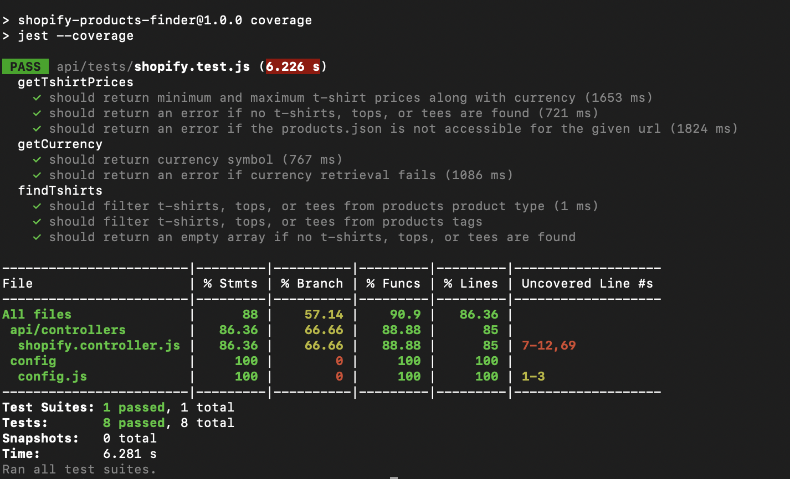

# Backend Dev Task

This app contains a solution for a simple Node Express API service running on AWS Lambda using the traditional Serverless Framework, which accepts Shopify store URL as an input and returns the prices of the least and the most expensive t-shirts offered by the store, along with the currency.

## Technology Stack

- ExpressJS
- Node.js

## Requirements

For development, you will need `Node.js v20.x (recommended)`, a node global package, `NPM`, and `serverless` installed in your environment.

### Prerequisites

Node.js (lts)

## App Setup

You can configure this app by following the instructions mentioned below:

### Clone Repository

Run command `git clone https://github.com/Arham-ifran/shopify-products-finder.git` to cone this public repository

### Install Packages

At the root directory of the application, run the following command to install packages:

`npm install`

### Run Project Locally

Start running project with following command:

`npm start` 

### Deployment to Serverless

API can be deployed by running the following command:

`serverless deploy`

### Automated Test Cases

Test cases are written for the provided solution in *./api/. Run the following command from the root directory:

`npm run test`

Run the following command to check the test coverage

`npm run coverage`

## Documentation

### API Working

- When the API is hit, it first sanitizes and validates the given input i.e. *url*. Once its validated, the function ***getPrices*** is called which holds the requested logic of the API.

- Assuming that a given Shopify store URL in an input would be a valid domain url w/o https just like we had in the sample input (i.e. "[livsndesigns.com](https://livsndesigns.com)") 

- In the provided code, the function ***getTshirtPrices*** is responsible for fetching the prices of t-shirts from a given Shopify store URL. Here's how it works:

    - **Fetching T-Shirt Data:** The function first fetches data about all products from the Shopify store *products.json* which is publicly available, and returns the JSON object containing the products information in the store.  
    - **Filtering T-Shirts:** Once that products data is fetched from the store then the function ***findTshirts*** is called to filter out only those products which holds the information for either tshirts, tops, tees etc. If the required data is found then it's added in the final products list.
    - **Extracting Prices:** After filtering out the t-shirts, the function extracts the prices of t-shirts by iterating over each t-shirt product and accessing the price of its variants. The prices are then stored in an array.
    - **Calculating Minimum and Maximum Prices:** The function calculates the minimum and maximum prices from the array of t-shirt prices using JavaScript's Math.min and Math.max functions.
    - **Fetching Currency:** The function ***getCurrency*** is called to fetch the currency used in the Shopify store. This is done by extracting the currency symbol from various elements within the HTML document of the given Shopify store URL. It checks for a data-currency attribute first, then looks for currency information in specific meta tags otherwise returns empty.
    - **Returning Results:** Finally, the function returns an object containing the status code, the URL of the Shopify store, the minimum and maximum t-shirt prices, and the currency used in the store.

- [Published API Documentation](https://documenter.getpostman.com/view/5864777/2sA2xh1Xwb)

### Error Handling

- The error messages returned by the API are iformative. 
- Handled unexpected errors using try-catch statement where needed.
- Returned the error messages where required.
- Tested error scenarios and unexpected errors.

### Hardships and Challenges

- This was my first attempt to retrieve products data from some Shopify store. Firstly, I had to figure out that how do I get data from the Shopify store then I noticed that there is *products.json* file from which I could get data for products available in the store. It is possible for a Shopify store's products.json file to not be publicly accessible so, I handled that case as well.
- I found that some of the stores named t-shirts as tees, tee or some similar keyword in their product type and tags so, I filtered products for all the similar keywords for t-shirts (i.e. tshirt, tshirts, t-shirt, t-shirts, top, tops, tee, tees).
- The difficulty encountered during development was obtaining the currency information. After examining numerous *products.json* files from Shopify stores, I observed that there was no currency data available. Therefore, I retrieved it from the site's meta tags.

### Additional Information

- The *index.js* is the starting point of this app.
- Only the required dependencies and devDepndencies are installed in the app.  

### Key Points

- I have made the project structure as flexible as possible, so it can be expanded any time.
- I have created the controllers, routes, utils, and tests in separate directories for the purpose of maintinability, scalability, and flexibility.
- As a bonus, I have added some of the unit tests as well.
- The project is deployed on an AWS serverless architecture, the link of the live API can be seen [here](https://po3ojquiye.execute-api.us-east-1.amazonaws.com/v1/shopify/t-shirt-prices). This is a POST url.